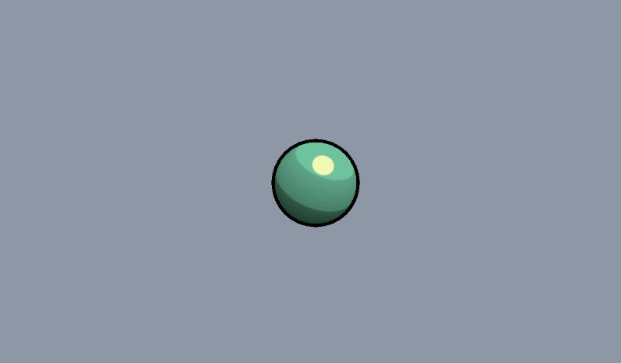
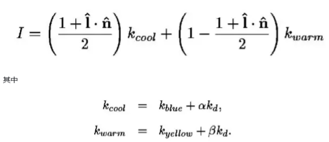
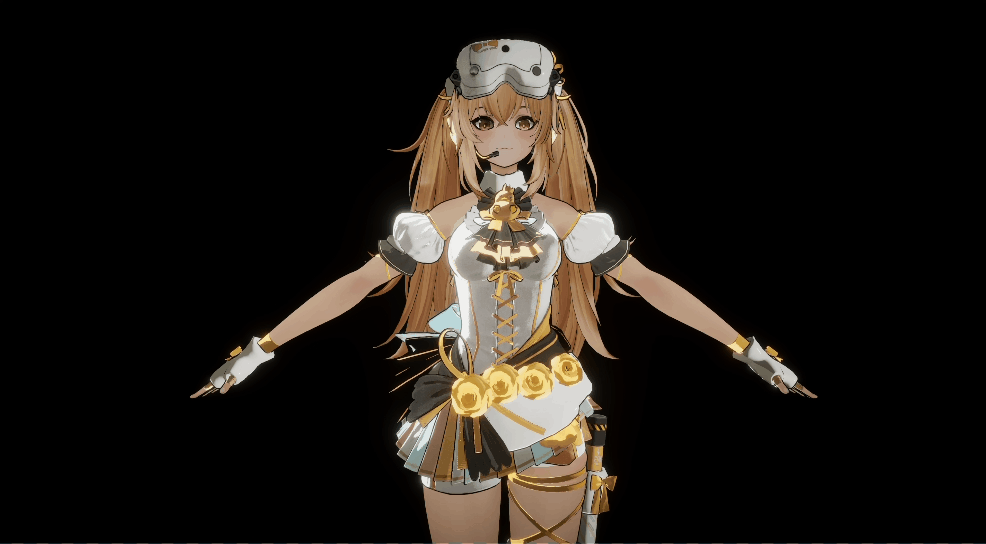
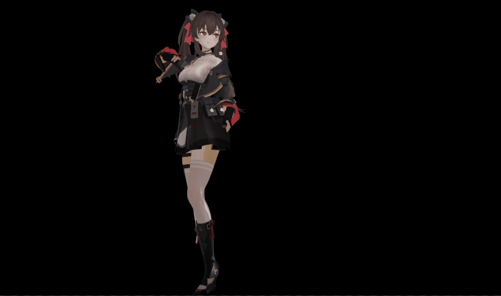
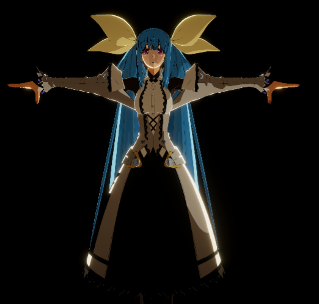

# Aspect URP Repository
My URP Learning Repository. 暂时将有一定工作量的效果放在这个仓库

## Notice: No model or texture assets because of copyright, so here are source files only.

# Contents

## Real-time Rendering cases

### 1. Shadow

### 2. AO

### 3. Ray Tracing

### 4. GI

## Unity shader cases(Toys)

### **1. PBR Shader**(基于物理渲染的Shader)

Physically Based Rendering

左图为Customed,右图为Unity自带。左图额外添加了闪烁的自发光，并使用了Reflection Probe。

### **2. NPR(非真实感渲染)**

Non-Photorealistic Rendering

* **Simple Toon Shader** , 简单卡通着色器，**BlinnPhong + Ramp Texture**

  

* **Stylized Toon Shader(风格化卡通着色器)**

  TODO: cel&tone based shading,stylized highlight,Pencil Sketch Shading,Hatching

  tangent

  

  

* **NPR Shader For Character**,mainly three schemes, some bugs or incorrect vision exist,please ignore them,do not affect. You can fix them according to your own requirements.

  1. **Girls Frontline**, PBR+ NPR

  

  **jiangyu**

  

  2. **Guilty Gear Strive/Xrd -------Dizzy**

  
  
  3. **Genshin / Star Trail**
  
  

### 3. 次表面散射效果(玉石，皮肤效果)

玉石效果

**左边是伪次表面散射，右边是基于Wrap Lighting的次表面散射(penetration depth实时计算出来)**

皮肤效果，使用预积分的方法计算次表面散射

//TODO:

### 4. Snow&ICE(雪&冰渲染)

曲面细分雪地 + Splatmap

### 5. Simulation(模拟)

绳子，布料

### 6. Simple Animation(Shader 动画)

序列帧，uv动画，顶点动画(暂定将简单的效果放在另一个仓库，用于基础案例，拿来即用)

### 7. 流麻

### 8. 镭射材质

### 9. Black Silk(黑丝材质)

### 10. Genster Wave(水体)

### 11. Water Magic(水魔法)

水涟漪，液体模拟，屏幕水滴

### 11. Grass(草地)-后置

### 12. 其它效果

### 13. 星体渲染

### 14. 管道流动

### 转场特效-后置

### 反射效果

### 风格化影子

[Unity中的反射效果（基于URP） - 知乎 (zhihu.com)](https://zhuanlan.zhihu.com/p/626597575)

[[Unity Shader\] 模拟管道流动效果（程序向） - 知乎 (zhihu.com)](https://zhuanlan.zhihu.com/p/688795740)

## Post Processing With URP

My another Repo: [aspect-ux/Mini-PostProcessing: a mini post processing system based on urp (github.com)](https://github.com/aspect-ux/Mini-PostProcessing)

### Rendering Tools

# Schedule

27，28两天完成

**渲染Part**

1. NPR+PBR解决方案,主参考unity-chan
2. shadow风格化，卡通？溶解？
3. 流体效果，sph，ns，2d/3d液体,
4. 次表面散射，玉石，皮肤
5. simulation,genster水体/涟漪/屏幕水滴
6. 星空，星体，宇宙
7. 溶解效果，各种结合，hologramic
8. 几何细分snow,grass
9. //TODO:其它待定

**天气系统**

* 归纳，ppt，绘图
* 性能优化，代码整理，github

**Houdini Part**

* 地形，河流常规案例
* 城市程序化生成

**个人引擎整理**

* opengl/dx11回顾

# Reference Lists

* NPR
  * [candycat1992/NPR_Lab: :pencil2: Test some NPR in Unity. (github.com)](https://github.com/candycat1992/NPR_Lab)
  * [przemyslawzaworski/Unity3D-CG-programming: Various shaders. (github.com)](https://github.com/przemyslawzaworski/Unity3D-CG-programming)
  * [UnityChanToonShaderVer2_Project/Assets/Toon/Shader at release/legacy/2.0 · unity3d-jp/UnityChanToonShaderVer2_Project (github.com)](https://github.com/unity3d-jp/UnityChanToonShaderVer2_Project/tree/release/legacy/2.0/Assets/Toon/Shader)
