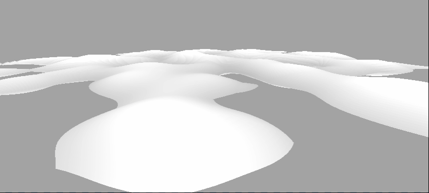

# Aspect URP Repository
My URP Learning Repository. 暂时将有一定工作量的效果放在这个仓库

## Notice: No model or texture assets because of copyright, so here are source files only.

# Contents

### **1. PBR Shader**(基于物理渲染的Shader)

Physically Based Rendering

左图为Customed,右图为Unity自带。左图额外添加了闪烁的自发光，并使用了Reflection Probe。

Ray Tracing on cpu

### **2. NPR(非真实感渲染)**

Non-Photorealistic Rendering

* **Simple Toon Shader** , 简单卡通着色器，**BlinnPhong + Ramp Texture**

  

* **Stylized Toon Shader(风格化卡通着色器)**

  TODO: cel&tone based shading,stylized highlight,Pencil Sketch Shading,Hatching

  tangent

  

  

* **NPR Shader For Character**,mainly three schemes, some bugs or incorrect vision exist,please ignore them,do not affect. You can fix them according to your own requirements.

  1. **Girls Frontline**, PBR+ NPR

  

  **jiangyu**

  

  2. **Guilty Gear Strive/Xrd -------Dizzy**

  
  
  3. **Genshin / Star Trail**
  
  

### 3. 次表面散射效果(玉石，皮肤效果)

玉石效果

**左边是伪次表面散射，右边是基于Wrap Lighting的次表面散射(penetration depth实时计算出来)**

皮肤效果，使用预积分的方法计算次表面散射

//TODO:

### 4. Snow&ICE(雪&冰渲染)

曲面细分雪地 + Splatmap

几何着色器+曲面细分草地

### 5. 屏幕空间反射SSPR

### 6. 次表面散射(玉石与皮肤)

左：伪次表面散射；右：Wrap Lighting

### 7. Ray Marching体积云

### 8. Stylized Water(风格化水体)

## 9. Post Processing With URP

My another Repo: [aspect-ux/Mini-PostProcessing: a mini post processing system based on urp (github.com)](https://github.com/aspect-ux/Mini-PostProcessing)

# TODOLists:

//TODO:

**渲染Part**

1. NPR+PBR解决方案,主参考unity-chan
2. shadow风格化，卡通？溶解？
3. 流体效果，sph，ns，2d/3d液体,
4. 次表面散射，玉石，皮肤
5. simulation,genster水体/涟漪/屏幕水滴
6. 星空，星体，宇宙
7. 溶解效果，各种结合，hologramic
8. 几何细分snow,grass

